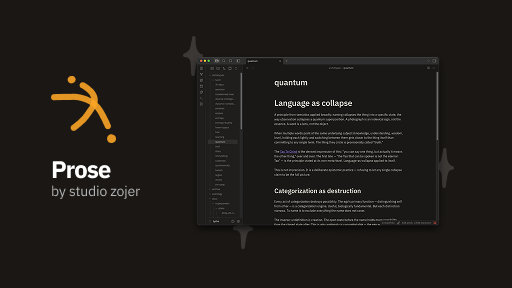

# Prose

A typographic Obsidian theme. IBM Plex, fluid scale, warm neutrals. Typography that gets out of the way and lets prose breathe.

## Design

- **Font family:** IBM Plex — Sans for body, headings, and UI; Mono for code
- **Type scale:** Minor third (1.2), fluid via `clamp()`
- **Measure:** 700px readable line width
- **Palette:** Warm neutrals — not gray, not beige. Light: `#faf9f7`. Dark: `#1a1917`
- **Dark mode:** Antialiased rendering, reduced font weight, slight letter-spacing compensation

## Installation

Available in **Settings → Appearance → Themes** within Obsidian.

Or manually: clone this repo into your vault's `.obsidian/themes/Prose/` directory.

## License

MIT — [zojer.studio](https://zojer.studio)
